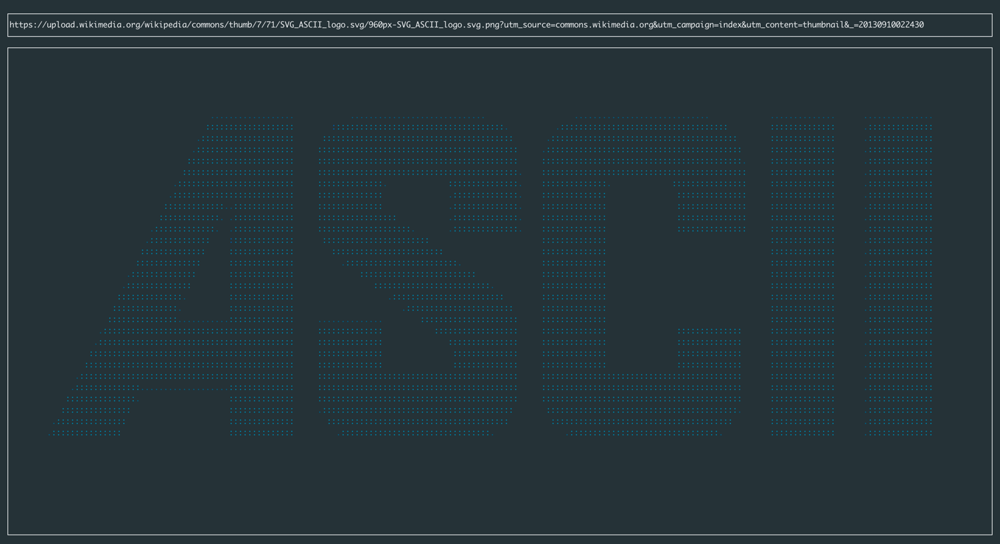

# tuascii

A terminal-based ASCII art renderer with color support. Converts images to ASCII art.

## Build

```bash
make
```

## Usage

```bash
./tuascii
```

Once the interface is running, paste an image URL to render it as ASCII art in the terminal.

For example:
